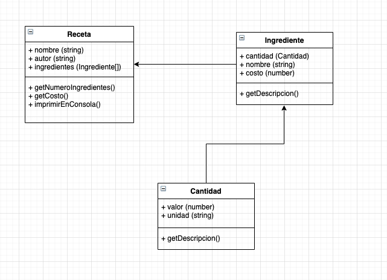

# Examen 01 Conceptos básicos

# La Receta

Se requiere desarrollar un sistema web que permita administrar las recetas de cocina de un restaurante. Para este sistema se ha diseñado la siguiente arquitectura la cual deberás implementar utilizando JavaScript

## Descripción de clases

La mayoría de los detalles de las clases para su implementación se pueden obtener del diagrama UML. Sin embargo a continuación se presentan algunas precisiones para algunos métodos o atributos de las clases.

--NOTA-- Para considerarse correctas, las respuestas (implementaciones) deberán aplicar de manera correcta los principios básicos de la programación orientada a objetos y las buenas prácticas para la escritura de código de programación.

### (3 Puntos)La clase Cantidad

Representa una medida de unidad por ejemplo: 100 gramos, 2 cucharadas, 4 litros

- (1 Punto) Atributos

  - valor. El valor numérico de la unidad, por ejemplo: 100, 2, etc.
  - unidad. El nombre de la unidad de medida, por ejemplo: gramos, cucharadas, litros.

- (2 puntos) Métodos
  - getDescripción(). Regresa un string con el valor y unidad de la cantidad, por ejemplo 100 gramos, 2 cucharadas, 4 litros.

## (3 puntos) La clase Ingrediente

Representa un ingrediente de la receta, por ejemplo: 100 gramos de azúcar, 2 litros de agua, etc así como su costo.

- (1 Punto) Atributos

  - nombre. nombre del ingrediente, por ejemplo azúcar, agua, etc.
  - cantidad. la cantidad a utilizar de ese ingrediente, por ejemplo 100 gramos, 2 litros, etc.
  - costo. el valor del ingrediente, por ejemplo 50, 100, 200

- (2 Puntos) Métodos
  - getDescripción(). Regresa un string con la descripción del string en el siguiente formato: 100 gramos de azúcar \$100

## (4 Puntos) La clase Receta

Representa a una receta de cocina

- (1 Punto) Atributos

  - nombre. nombre de la receta
  - autor. nombre del autor de la receta
  - ingredientes. la lista de ingredientes de la receta

- Métodos

  - (1 punto) getNumeroIngredientes(). Regresa el número de ingredientes que se incluyen en la receta.
  - (1 punto) getCosto(). Regresa el costo total de la receta
  - (1 punto) imprimirEnConsola(). Imprime el contenido de la receta en consola en el siguiente formato:

  Pizza Hawaiana
  Autor: Juan Pérez
  Ingredientes:

  1. 100 gramos de harina (\$100)
  2. 5 rebanadas de piña (\$230)

  Costo total: \$130 pesos
